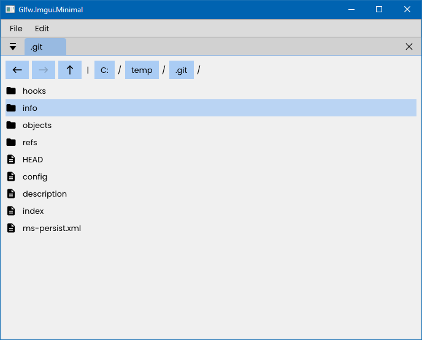

# glfw-imgui-minimal

Minimal Glfw project with IMGUI and the latest OpenGL.

This project-template makes use of the following libraries/projects:

* [GLFW](https://www.glfw.org/)
* [IMGUI](https://github.com/ocornut/imgui/)
* [CPM](https://github.com/cpm-cmake/CPM.cmake)
* [GLAD](https://glad.dav1d.de/)

